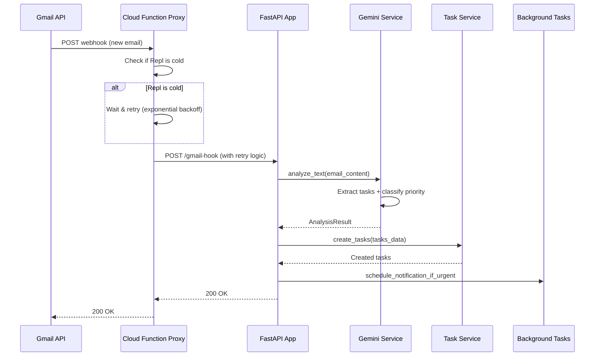
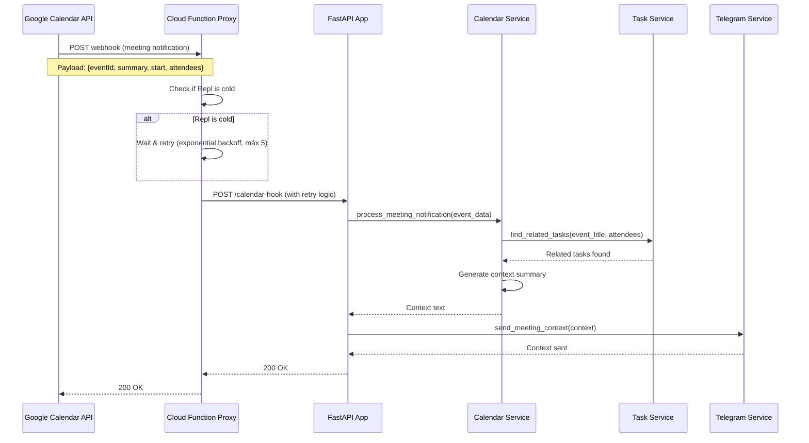
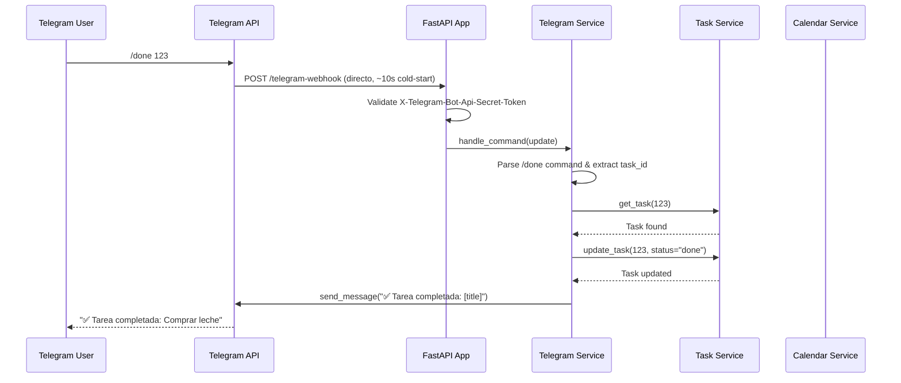
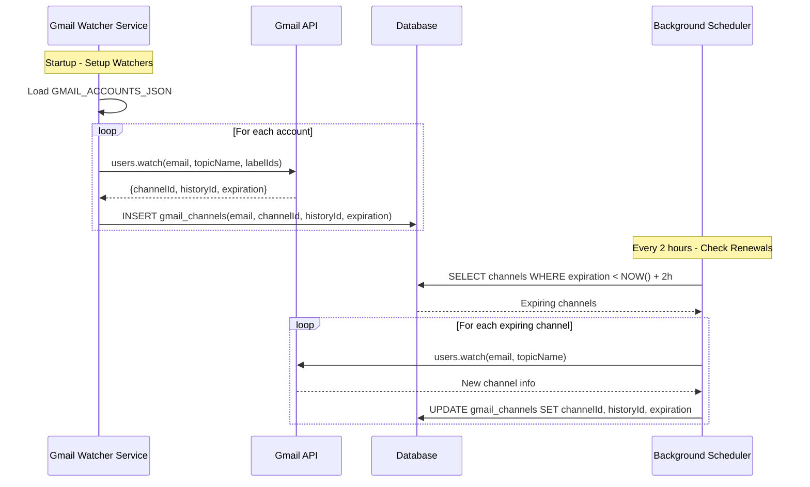
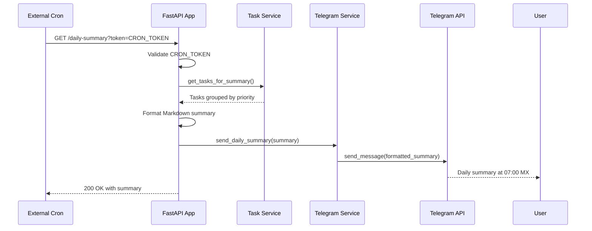

# Design Document

## Overview

El personal_assistant_bot es un sistema distribuido que integra múltiples servicios (Gmail, Google Calendar, Telegram) con inteligencia artificial (Gemini 1.5 Pro) para gestión automatizada de tareas. El sistema utiliza una arquitectura basada en webhooks con proxy para manejar cold-starts, persistencia en SQLite con capacidades async, y un diseño modular que facilita escalabilidad y mantenimiento.

### Arquitectura General

```mermaid
graph TB
    subgraph "External Services"
        Gmail[Gmail API]
        Calendar[Google Calendar API]
        TelegramAPI[Telegram Bot API]
        Gemini[Gemini 1.5 Pro API]
    end
    
    subgraph "Proxy Layer (Cloud Function)"
        Proxy[Webhook Proxy]
    end
    
    subgraph "Replit Environment"
        subgraph "FastAPI Application"
            WebhookEndpoints[Webhook Endpoints<br/>/gmail-hook<br/>/calendar-hook<br/>/telegram-webhook]
            RestAPI[REST API<br/>/health<br/>/daily-summary<br/>/metrics<br/>/tasks/*]
            BackgroundTasks[Background Tasks]
        end
        
        subgraph "Core Services"
            GeminiService[Gemini Service<br/>analyze_text()]
            TaskService[Task Service<br/>CRUD + Priority]
            TelegramService[Telegram Service<br/>Commands + Notifications]
            CalendarService[Calendar Service<br/>Event Management]
            GmailWatcherService[Gmail Watcher Service<br/>Multi-account Management]
            BackupService[Backup Service<br/>Daily Backups]
        end
        
        subgraph "Data Layer"
            SQLite[(SQLite Database<br/>tasks table)]
            BackupSystem[Backup System<br/>/backups/*.db]
        end
    end
    
    subgraph "External Triggers"
        CronJob[Cron Job<br/>Daily Summary]
        TelegramUser[Telegram User]
    end
    
    Gmail --> Proxy
    Calendar --> Proxy
    TelegramAPI --> WebhookEndpoints
    Proxy --> WebhookEndpoints
    
    WebhookEndpoints --> GeminiService
    WebhookEndpoints --> TaskService
    WebhookEndpoints --> TelegramService
    WebhookEndpoints --> CalendarService
    
    GeminiService --> Gemini
    TelegramService --> TelegramAPI
    CalendarService --> Calendar
    
    TaskService --> SQLite
    BackgroundTasks --> SQLite
    BackgroundTasks --> BackupSystem
    
    CronJob --> RestAPI
    TelegramUser --> TelegramAPI
    
    RestAPI --> TaskService
```

## Architecture

### 1. Proxy Layer (Cloud Function/Cloud Run)

**Propósito**: Manejar webhooks de Gmail y Calendar, garantizando entrega confiable al Repl.

**Componentes**:
- **Webhook Receiver**: Recibe webhooks de Gmail y Calendar
- **Cold-Start Handler**: Detecta cuando el Repl está frío y maneja reintentos
- **Retry Logic**: Implementa backoff exponencial (máximo 5 intentos)
- **Request Forwarding**: Reenvía payloads al Repl con headers de autenticación

**Gmail Webhook Handling**:
- Recepción POST /gmail-hook
- Respuesta HTTP 2xx en < 1s
- Reintentos exponenciales si Repl está frío
- Campos clave: messageId, snippet

**Calendar Webhook Handling**:
- Recepción POST /calendar-hook
- Respuesta HTTP 2xx en < 1s
- Reintentos exponenciales (máx 5) si el Repl está frío
- Campos clave del payload: eventId, summary, start, attendees

**Tecnologías**:
- Google Cloud Functions o Cloud Run
- Python 3.12 con httpx para requests async
- Logging estructurado para debugging

### 2. FastAPI Application Layer

**Propósito**: API principal que maneja webhooks, REST endpoints y lógica de negocio.

**Endpoints**:
```python
# Webhooks
POST /gmail-hook          # Recibe notificaciones de Gmail
POST /calendar-hook       # Recibe notificaciones de Calendar  
POST /telegram-webhook    # Recibe updates de Telegram (directo, latencia ~10s cold-start)

# REST API
GET  /health             # Health check
GET  /daily-summary      # Resumen diario (cron)
GET  /metrics           # Métricas Prometheus
GET  /tasks              # Listar tareas con filtros (priority, status, source, paginación)
GET  /tasks/{id}        # Obtener tarea específica
PUT  /tasks/{id}        # Actualizar tarea específica

# OpenAPI Documentation
GET  /docs              # Swagger UI automático
GET  /openapi.json      # OpenAPI spec
```

**GET /tasks Query Parameters**:
```python
# Filtros disponibles
?priority=urgent,high     # Filtrar por prioridad
?status=open,done        # Filtrar por estado
?source=email@domain.com # Filtrar por cuenta origen
?page=1&size=50         # Paginación (default: page=1, size=20)
?sort=created_at        # Ordenamiento (created_at, due, priority)
?order=desc             # Dirección (asc, desc)

# Ejemplo de respuesta
{
  "items": [TaskResponse],
  "total": 150,
  "page": 1,
  "size": 20,
  "pages": 8
}
```

**Middleware Stack**:
- Request logging con request_id único
- Error handling centralizado
- Metrics collection para Prometheus
- Security headers y CORS

### 3. Core Services Layer

#### 3.1 Gemini Service

**Responsabilidades**:
- Análisis inteligente de texto de correos y mensajes
- Extracción de tareas estructuradas
- Clasificación automática de prioridad
- Manejo robusto de errores con reintentos

**Interface**:
```python
class GeminiService:
    async def analyze_text(self, text: str, source: str) -> AnalysisResult:
        """
        Analiza texto y extrae tareas con contexto.
        
        Returns:
            AnalysisResult {
                tasks: List[TaskData],
                context: str,
                priority: Priority
            }
        """
        
    async def _call_gemini_with_retry(self, prompt: str) -> dict:
        """Llama a Gemini con 3 reintentos y backoff 2^n segundos"""
```

**Prompt Engineering**:
- Prompts estructurados para extracción consistente de tareas
- Clasificación de urgencia basada en contenido y fechas límite
- Contexto específico por fuente (Gmail vs Telegram vs Calendar)

#### 3.2 Task Service

**Responsabilidades**:
- CRUD operations para tareas
- Gestión de prioridades y estados
- Búsqueda y filtrado avanzado
- Validación de límites de escalabilidad

**Data Model**:
```python
class Task(Base):
    __tablename__ = "tasks"
    
    id: Mapped[int] = mapped_column(primary_key=True)
    title: Mapped[str] = mapped_column(String(500))
    due: Mapped[Optional[datetime]] = mapped_column(DateTime)
    status: Mapped[str] = mapped_column(String(20))  # open, done
    source: Mapped[str] = mapped_column(String(100))  # email@domain.com
    priority: Mapped[str] = mapped_column(String(10))  # urgent, high, normal, low
    created_at: Mapped[datetime] = mapped_column(DateTime, server_default=func.now())
    updated_at: Mapped[datetime] = mapped_column(DateTime, onupdate=func.now())
```

**Business Logic**:
- Auto-clasificación urgent para tareas con due < 24h
- Validación de límite 10k tareas con aviso de migración
- Soft delete para auditoría
- Indexing optimizado para queries frecuentes

#### 3.3 Telegram Service

**Responsabilidades**:
- Manejo de comandos de bot (/add, /done, /list, /calendar)
- Envío de notificaciones y resúmenes
- Validación de tokens de seguridad
- Formateo de mensajes con Markdown

**Commands Implementation**:
```python
class TelegramService:
    async def handle_add_command(self, text: str, user_id: int) -> str:
        """Crea nueva tarea desde comando /add"""
        
    async def handle_done_command(self, task_id: int, user_id: int) -> str:
        """Marca tarea como completada con confirmación"""
        task = await self.task_service.get_task(task_id)
        if not task:
            return f"❌ Tarea {task_id} no encontrada"
        
        if task.status == TaskStatus.DONE:
            return f"✅ Tarea {task_id} ya estaba completada"
            
        await self.task_service.update_task(task_id, {"status": TaskStatus.DONE})
        return f"✅ Tarea completada: {task.title}"
        
    async def handle_list_command(self, user_id: int) -> str:
        """Lista tareas agrupadas por prioridad"""
        
    async def handle_calendar_command(self, datetime_str: str, text: str) -> str:
        """Crea evento en Google Calendar"""
        
    async def send_daily_summary(self, summary: str, user_id: int) -> bool:
        """Envía resumen diario formateado"""
```

**Message Formatting**:
- Markdown para resúmenes estructurados
- Emojis para indicadores de prioridad
- Agrupación visual por categorías (urgent/high/normal/low)

#### 3.4 Calendar Service

**Responsabilidades**:
- Integración con Google Calendar API
- Creación de eventos desde Telegram
- Procesamiento de notificaciones de reuniones (eventId, summary, start, attendees)
- Búsqueda de tareas relacionadas por contexto
- Manejo de reintentos exponenciales (≤ 5 intentos)

**Integration Pattern**:
```python
class CalendarService:
    async def create_event(self, datetime: datetime, title: str, description: str) -> str:
        """Crea evento en Google Calendar"""
        
    async def process_meeting_notification(self, event_data: dict) -> str:
        """
        Procesa notificación de reunión y busca contexto de tareas
        
        event_data: {
            "eventId": "event_123",
            "summary": "Team Meeting",
            "start": "2024-01-15T10:00:00Z",
            "attendees": ["user1@domain.com", "user2@domain.com"]
        }
        """
        
    async def find_related_tasks(self, event_title: str, attendees: List[str]) -> List[Task]:
        """Busca tareas relacionadas con la reunión"""
```

#### 3.5 Gmail Watcher Service

**Responsabilidades**:
- Gestión multi-cuenta de Gmail
- Registro y renovación de users.watch() cada 24h
- Persistencia de channelId, historyId, expiration
- Manejo de tokens de autenticación por cuenta

**Implementation**:
```python
class GmailWatcherService:
    async def setup_watchers(self) -> None:
        """Configura watchers para todas las cuentas en GMAIL_ACCOUNTS_JSON"""
        accounts = json.loads(self.settings.gmail_accounts_json)
        for account in accounts:
            await self.register_watcher(account)
    
    async def register_watcher(self, account: dict) -> None:
        """Registra users.watch() para una cuenta específica"""
        
    async def renew_watchers(self) -> None:
        """Renueva watchers que expiran en < 2 horas"""
        
    async def store_channel_info(self, email: str, channel_id: str, 
                                history_id: str, expiration: datetime) -> None:
        """Persiste información del canal en gmail_channels table"""
```

### 4. Data Layer

#### 4.1 SQLite Database con SQLAlchemy Async

**Configuración**:
```python
# Async SQLite setup
engine = create_async_engine(
    "sqlite+aiosqlite:///home/runner/db.sqlite3",
    echo=True,  # Logging SQL en desarrollo
    pool_pre_ping=True,
    pool_recycle=3600
)

async_session = async_sessionmaker(
    engine, 
    expire_on_commit=False,
    class_=AsyncSession
)
```

**Schema Design**:
- Tabla `tasks` con índices optimizados
- Tabla `backup_log` para tracking de backups
- Tabla `metrics` para estadísticas internas
- Foreign keys habilitadas con pragma

**Performance Optimizations**:
- Índices compuestos en (status, priority, due)
- Índice en source para filtrado por cuenta
- Connection pooling configurado
- Query optimization con eager loading

#### 4.2 Backup System

**Estrategia**:
- Backup diario automático vía background task programado al iniciar FastAPI
- Retención de 7 días en carpeta `/home/runner/backups`
- Compresión gzip para optimizar espacio
- Verificación de integridad post-backup

**Implementation**:
```python
class BackupService:
    async def run_daily(self) -> None:
        """Scheduler principal ejecutado via asyncio.create_task() al iniciar FastAPI"""
        while True:
            await asyncio.sleep(86400)  # 24 horas
            await self.create_daily_backup()
            await self.cleanup_old_backups()
    
    async def create_daily_backup(self) -> bool:
        """Crea backup diario con timestamp en /home/runner/backups"""
        timestamp = datetime.now().strftime("%Y%m%d_%H%M%S")
        backup_path = f"/home/runner/backups/db_backup_{timestamp}.sqlite3.gz"
        
    async def cleanup_old_backups(self) -> int:
        """Elimina backups > 7 días de /home/runner/backups"""
        
    async def verify_backup_integrity(self, backup_path: str) -> bool:
        """Verifica integridad del backup"""
```

**FastAPI Startup Integration**:
```python
@app.on_event("startup")
async def startup_event():
    # Iniciar backup scheduler
    backup_service = BackupService()
    asyncio.create_task(backup_service.run_daily())
```

## Components and Interfaces

### 1. Gmail Webhook Processing Pipeline



### 2. Calendar Webhook Processing Pipeline



### 3. Telegram Command Processing



### 4. Gmail Watcher Registration & Renewal



### 5. Daily Summary Generation



## Data Models

### 1. Core Task Model

```python
from sqlalchemy.ext.asyncio import AsyncAttrs
from sqlalchemy.orm import DeclarativeBase, Mapped, mapped_column
from sqlalchemy import String, DateTime, Integer, func
from datetime import datetime
from typing import Optional
from enum import Enum

class Base(AsyncAttrs, DeclarativeBase):
    pass

class Priority(str, Enum):
    URGENT = "urgent"
    HIGH = "high" 
    NORMAL = "normal"
    LOW = "low"

class TaskStatus(str, Enum):
    OPEN = "open"
    DONE = "done"

class Task(Base):
    __tablename__ = "tasks"
    
    id: Mapped[int] = mapped_column(Integer, primary_key=True)
    title: Mapped[str] = mapped_column(String(500), nullable=False)
    due: Mapped[Optional[datetime]] = mapped_column(DateTime, nullable=True)
    status: Mapped[TaskStatus] = mapped_column(String(20), default=TaskStatus.OPEN)
    source: Mapped[str] = mapped_column(String(100), nullable=False)  # email origen
    priority: Mapped[Priority] = mapped_column(String(10), default=Priority.NORMAL)
    created_at: Mapped[datetime] = mapped_column(DateTime, server_default=func.now())
    updated_at: Mapped[datetime] = mapped_column(DateTime, onupdate=func.now())
    
    # Índices para optimización
    __table_args__ = (
        Index('idx_status_priority_due', 'status', 'priority', 'due'),
        Index('idx_source', 'source'),
        Index('idx_created_at', 'created_at'),
    )

class GmailChannel(Base):
    __tablename__ = "gmail_channels"
    
    id: Mapped[int] = mapped_column(Integer, primary_key=True)
    email: Mapped[str] = mapped_column(String(100), nullable=False, unique=True)
    channel_id: Mapped[str] = mapped_column(String(100), nullable=False)
    history_id: Mapped[str] = mapped_column(String(50), nullable=False)
    expiration: Mapped[datetime] = mapped_column(DateTime, nullable=False)
    created_at: Mapped[datetime] = mapped_column(DateTime, server_default=func.now())
    updated_at: Mapped[datetime] = mapped_column(DateTime, onupdate=func.now())
    
    __table_args__ = (
        Index('idx_email', 'email'),
        Index('idx_expiration', 'expiration'),
    )
```

### 2. API Response Models

```python
from pydantic import BaseModel, Field
from typing import List, Optional
from datetime import datetime

class TaskResponse(BaseModel):
    id: int
    title: str
    due: Optional[datetime] = None
    status: TaskStatus
    source: str
    priority: Priority
    created_at: datetime
    updated_at: datetime
    
    class Config:
        from_attributes = True

class TaskCreate(BaseModel):
    title: str = Field(..., min_length=1, max_length=500)
    due: Optional[datetime] = None
    source: str = Field(..., min_length=1, max_length=100)
    priority: Priority = Priority.NORMAL

class TaskUpdate(BaseModel):
    title: Optional[str] = Field(None, min_length=1, max_length=500)
    due: Optional[datetime] = None
    status: Optional[TaskStatus] = None
    priority: Optional[Priority] = None

class AnalysisResult(BaseModel):
    tasks: List[TaskCreate]
    context: str
    priority: Priority

class DailySummaryResponse(BaseModel):
    date: datetime
    urgent_tasks: List[TaskResponse]
    high_tasks: List[TaskResponse]
    normal_tasks: List[TaskResponse]
    low_tasks: List[TaskResponse]
    completed_today: int
    total_pending: int
    summary_text: str
```

### 3. Configuration Models

```python
from pydantic import Field, field_validator
from pydantic_settings import BaseSettings
from typing import List, Dict

class Settings(BaseSettings):
    # Telegram
    telegram_token: str = Field(..., env="TELEGRAM_TOKEN")
    telegram_webhook_secret: str = Field(..., env="TELEGRAM_WEBHOOK_SECRET")
    
    # Gmail & Calendar
    gmail_accounts_json: str = Field(..., env="GMAIL_ACCOUNTS_JSON")
    calendar_credentials_json: str = Field(..., env="CALENDAR_CREDENTIALS_JSON")
    
    # Gemini
    gemini_api_key: str = Field(..., env="GEMINI_API_KEY")
    
    # Cron
    cron_token: str = Field(..., env="CRON_TOKEN")
    
    # Database
    database_url: str = Field(default="sqlite+aiosqlite:///home/runner/db.sqlite3")
    
    # Backup
    backup_retention_days: int = Field(default=7)
    backup_directory: str = Field(default="/home/runner/backups")
    
    # Limits
    max_tasks_limit: int = Field(default=10000)
    
    model_config = {
        "env_file": ".env",
        "case_sensitive": False,
        "extra": "ignore"
    }
```

## Deployment Considerations

### Replit Optimization

El sistema ha sido optimizado para deployment en Replit con las siguientes mejoras:

**Pydantic v2 Compatibility**:
- Migrado de `pydantic.BaseSettings` a `pydantic-settings.BaseSettings`
- Actualizado validators de `@validator` a `@field_validator` con `@classmethod`
- Reemplazado `class Config` con `model_config` dictionary
- Configurado `"extra": "ignore"` para mayor flexibilidad

**Simplified Dependencies**:
- Removido constraints de versión estrictos que causaban conflictos
- Dependencies sin versiones específicas para mayor compatibilidad
- Fallback automático para directorios que no se pueden crear

**Environment Variables**:
- Simplificado `X_TELEGRAM_BOT_API_SECRET_TOKEN` → `TELEGRAM_WEBHOOK_SECRET`
- Validación robusta con defaults para variables opcionales
- Cross-platform path handling

**Startup Process**:
```python
# start.py - Robust startup script
def main():
    install_dependencies()    # Auto-install from requirements.txt
    check_environment()      # Validate required env vars
    start_application()      # Launch FastAPI with uvicorn
```

**File Structure Cleanup**:
- Single `requirements.txt` (no duplicates)
- Simplified `replit.nix` (system deps only)
- Removed redundant install scripts

## Error Handling

### 1. Exception Hierarchy

```python
class PersonalAssistantError(Exception):
    """Base exception para el sistema"""
    pass

class GeminiServiceError(PersonalAssistantError):
    """Errores relacionados con Gemini API"""
    pass

class TaskServiceError(PersonalAssistantError):
    """Errores relacionados con gestión de tareas"""
    pass

class TelegramServiceError(PersonalAssistantError):
    """Errores relacionados con Telegram"""
    pass

class CalendarServiceError(PersonalAssistantError):
    """Errores relacionados con Google Calendar"""
    pass

class DatabaseError(PersonalAssistantError):
    """Errores relacionados con base de datos"""
    pass

class ConfigurationError(PersonalAssistantError):
    """Errores de configuración"""
    pass
```

### 2. Error Handling Strategy

**Global Exception Handler**:
```python
@app.exception_handler(Exception)
async def global_exception_handler(request: Request, exc: Exception):
    request_id = getattr(request.state, 'request_id', 'unknown')
    
    logger.error(
        "Unhandled exception",
        extra={
            "request_id": request_id,
            "path": request.url.path,
            "method": request.method,
            "exception": str(exc),
            "exception_type": type(exc).__name__
        },
        exc_info=True
    )
    
    return JSONResponse(
        status_code=500,
        content={
            "error": "Internal server error",
            "request_id": request_id
        }
    )
```

**Service-Level Error Handling**:
- Retry logic con exponential backoff para APIs externas
- Circuit breaker pattern para servicios críticos
- Graceful degradation cuando servicios no están disponibles
- Error logging estructurado con contexto completo

### 3. Monitoring & Alerting

**Structured Logging**:
```python
import structlog
from datetime import datetime

logger = structlog.get_logger()

# Log format
{
    "timestamp": "2024-01-15T10:30:00Z",
    "level": "ERROR",
    "request_id": "req_123456",
    "service": "gemini_service",
    "operation": "analyze_text",
    "error": "API rate limit exceeded",
    "retry_count": 2,
    "user_id": "telegram_user_789"
}
```

**Prometheus Metrics**:
```python
from prometheus_client import Counter, Histogram, Gauge

# Métricas de negocio
tasks_total = Counter('tasks_total', 'Total tasks created', ['source', 'priority'])
tasks_completed = Counter('tasks_completed_total', 'Total tasks completed')
webhook_requests = Counter('webhook_requests_total', 'Webhook requests', ['endpoint', 'status'])

# Métricas técnicas
request_duration = Histogram('request_duration_seconds', 'Request duration', ['endpoint'])
active_connections = Gauge('active_connections', 'Active database connections')
gemini_api_calls = Counter('gemini_api_calls_total', 'Gemini API calls', ['status'])
```

## Testing Strategy

### 1. Unit Tests

**Coverage Requirements**: ≥80% con pytest-cov

**Test Structure**:
```python
# tests/unit/services/test_gemini_service.py
import pytest
from unittest.mock import AsyncMock, patch
from services.gemini_service import GeminiService

class TestGeminiService:
    @pytest.fixture
    async def gemini_service(self):
        return GeminiService(api_key="test_key")
    
    @patch('httpx.AsyncClient.post')
    async def test_analyze_text_success(self, mock_post, gemini_service):
        # Mock successful API response
        mock_post.return_value.json.return_value = {
            "tasks": [{"title": "Test task", "priority": "normal"}],
            "context": "Test context"
        }
        
        result = await gemini_service.analyze_text("Test email content", "test@example.com")
        
        assert len(result.tasks) == 1
        assert result.tasks[0].title == "Test task"
        assert result.priority == Priority.NORMAL
    
    @patch('httpx.AsyncClient.post')
    async def test_analyze_text_with_retry(self, mock_post, gemini_service):
        # Mock API failure then success
        mock_post.side_effect = [
            httpx.RequestError("Connection failed"),
            httpx.RequestError("Connection failed"),
            AsyncMock(json=lambda: {"tasks": [], "context": ""})
        ]
        
        result = await gemini_service.analyze_text("Test content", "test@example.com")
        
        assert mock_post.call_count == 3
        assert result is not None
```

### 2. Integration Tests

**Database Integration**:
```python
# tests/integration/test_task_service.py
import pytest
from sqlalchemy.ext.asyncio import create_async_engine, async_sessionmaker
from services.task_service import TaskService

@pytest.fixture
async def test_db():
    engine = create_async_engine("sqlite+aiosqlite:///:memory:")
    async with engine.begin() as conn:
        await conn.run_sync(Base.metadata.create_all)
    
    session = async_sessionmaker(engine)
    yield session
    await engine.dispose()

class TestTaskServiceIntegration:
    async def test_create_and_retrieve_task(self, test_db):
        task_service = TaskService(test_db)
        
        task_data = TaskCreate(
            title="Integration test task",
            source="test@example.com",
            priority=Priority.HIGH
        )
        
        created_task = await task_service.create_task(task_data)
        retrieved_task = await task_service.get_task(created_task.id)
        
        assert retrieved_task.title == "Integration test task"
        assert retrieved_task.priority == Priority.HIGH
```

### 3. End-to-End Tests

**Webhook Flow Testing**:
```python
# tests/e2e/test_webhook_flow.py
import pytest
from httpx import AsyncClient
from main import app

class TestWebhookFlow:
    @pytest.fixture
    async def client(self):
        async with AsyncClient(app=app, base_url="http://test") as ac:
            yield ac
    
    async def test_gmail_webhook_to_task_creation(self, client, mock_gemini):
        webhook_payload = {
            "messageId": "test_message_123",
            "snippet": "Remember to buy groceries tomorrow"
        }
        
        response = await client.post("/gmail-hook", json=webhook_payload)
        
        assert response.status_code == 200
        
        # Verify task was created
        tasks_response = await client.get("/tasks")
        tasks = tasks_response.json()
        
        assert len(tasks) == 1
        assert "groceries" in tasks[0]["title"]
```

### 4. Performance Tests

**Load Testing con Locust**:
```python
# tests/performance/locustfile.py
from locust import HttpUser, task, between

class WebhookUser(HttpUser):
    wait_time = between(1, 3)
    
    @task(3)
    def test_gmail_webhook(self):
        payload = {
            "messageId": f"msg_{self.user_id}_{self.time()}",
            "snippet": "Test email content for load testing"
        }
        self.client.post("/gmail-hook", json=payload)
    
    @task(2)
    def test_telegram_webhook(self):
        payload = {
            "update_id": self.time(),
            "message": {
                "text": "/list",
                "from": {"id": self.user_id}
            }
        }
        self.client.post("/telegram-webhook", json=payload)
    
    @task(1)
    def test_health_check(self):
        self.client.get("/health")
```

## Security

### 1. Authentication & Authorization

**Webhook Security**:
- Validación de `X-Telegram-Bot-Api-Secret-Token` para Telegram
- Validación de `CRON_TOKEN` para endpoints de cron
- IP whitelisting en proxy para servicios conocidos
- Rate limiting por IP y endpoint

**API Security**:
```python
from fastapi import HTTPException, Depends, Header
from typing import Optional

async def validate_telegram_webhook(
    x_telegram_bot_api_secret_token: Optional[str] = Header(None)
) -> bool:
    if not x_telegram_bot_api_secret_token:
        raise HTTPException(status_code=401, detail="Missing secret token")
    
    if x_telegram_bot_api_secret_token != settings.telegram_webhook_secret:
        raise HTTPException(status_code=403, detail="Invalid secret token")
    
    return True

async def validate_cron_token(token: str) -> bool:
    if token != settings.cron_token:
        raise HTTPException(status_code=403, detail="Invalid cron token")
    return True
```

### 2. Data Protection

**Secrets Management**:
- Las credenciales se almacenan en Replit Secrets y se acceden en tiempo de ejecución mediante os.environ; nunca se hardcodean en el repositorio
- Rotación periódica de tokens y API keys
- Encriptación de datos sensibles en base de datos
- Logs sin información sensible (PII masking)

**Database Security**:
```python
# SQLite con WAL mode y foreign keys
PRAGMA journal_mode = WAL;
PRAGMA foreign_keys = ON;
PRAGMA secure_delete = ON;
PRAGMA temp_store = MEMORY;
```

### 3. Input Validation & Sanitization

**Pydantic Models con Validación**:
```python
from pydantic import BaseModel, validator, Field
import re

class TaskCreate(BaseModel):
    title: str = Field(..., min_length=1, max_length=500)
    source: str = Field(..., regex=r'^[a-zA-Z0-9._%+-]+@[a-zA-Z0-9.-]+\.[a-zA-Z]{2,}$')
    
    @validator('title')
    def sanitize_title(cls, v):
        # Remove potentially dangerous characters
        return re.sub(r'[<>"\']', '', v).strip()
    
    @validator('source')
    def validate_email_source(cls, v):
        # Additional email validation
        if not v or '@' not in v:
            raise ValueError('Invalid email format')
        return v.lower()
```

### 4. Security Headers & CORS

```python
from fastapi.middleware.cors import CORSMiddleware
from fastapi.middleware.trustedhost import TrustedHostMiddleware

# Security middleware
app.add_middleware(
    TrustedHostMiddleware, 
    allowed_hosts=["*.replit.dev", "localhost"]
)

app.add_middleware(
    CORSMiddleware,
    allow_origins=["https://api.telegram.org"],
    allow_credentials=False,
    allow_methods=["POST"],
    allow_headers=["*"],
)

# Security headers
@app.middleware("http")
async def add_security_headers(request: Request, call_next):
    response = await call_next(request)
    response.headers["X-Content-Type-Options"] = "nosniff"
    response.headers["X-Frame-Options"] = "DENY"
    response.headers["X-XSS-Protection"] = "1; mode=block"
    response.headers["Strict-Transport-Security"] = "max-age=31536000; includeSubDomains"
    return response
```

## DevOps & CI/CD

### 1. Continuous Integration Pipeline

**GitHub Actions Workflow** (`.github/workflows/ci.yml`):
```yaml
name: CI Pipeline

on:
  push:
    branches: [ main, develop ]
  pull_request:
    branches: [ main ]

jobs:
  test:
    runs-on: ubuntu-latest
    
    steps:
    - uses: actions/checkout@v3
    
    - name: Set up Python 3.12
      uses: actions/setup-python@v4
      with:
        python-version: '3.12'
    
    - name: Install dependencies
      run: |
        pip install -r requirements.txt
        pip install pytest pytest-cov coverage
    
    - name: Run detect-secrets scan
      run: |
        pip install detect-secrets
        detect-secrets scan --all-files --baseline .secrets.baseline
        if [ $? -ne 0 ]; then
          echo "❌ Secrets detected in repository"
          exit 1
        fi
    
    - name: Run tests with coverage
      run: |
        pytest --cov=. --cov-report=xml --cov-report=term-missing
        coverage xml
    
    - name: Check coverage threshold
      run: |
        COVERAGE=$(coverage report --format=total)
        echo "Coverage: ${COVERAGE}%"
        if [ "$COVERAGE" -lt 80 ]; then
          echo "❌ Coverage ${COVERAGE}% is below required 80%"
          exit 1
        fi
        echo "✅ Coverage ${COVERAGE}% meets requirement"
    
    - name: Code formatting check
      run: |
        black --check .
        ruff check .
    
    - name: Upload coverage to Codecov
      uses: codecov/codecov-action@v3
      with:
        file: ./coverage.xml
```

### 2. Quality Gates

**Pre-commit Hooks** (`.pre-commit-config.yaml`):
```yaml
repos:
  - repo: https://github.com/psf/black
    rev: 23.1.0
    hooks:
      - id: black
        language_version: python3.12

  - repo: https://github.com/charliermarsh/ruff-pre-commit
    rev: v0.0.254
    hooks:
      - id: ruff
        args: [--fix, --exit-non-zero-on-fix]

  - repo: https://github.com/Yelp/detect-secrets
    rev: v1.4.0
    hooks:
      - id: detect-secrets
        args: ['--baseline', '.secrets.baseline']
```

**Coverage Requirements**:
- Cobertura mínima: 80%
- Falla el pipeline si coverage < 80%
- Reportes automáticos en PRs
- Exclusiones permitidas solo para código de configuración

### 3. Deployment Strategy

**Replit Deployment**:
- Auto-deploy desde branch `main` 
- Variables de entorno via Replit Secrets
- Health check post-deployment
- Rollback automático si health check falla

**Environment Management**:
```python
# .replit
run = "python main.py"
modules = ["python-3.12"]

[nix]
channel = "stable-23.11"

[deployment]
run = ["sh", "-c", "python main.py"]
deploymentTarget = "cloudrun"

[[ports]]
localPort = 8080
externalPort = 80
```

Este diseño proporciona una base sólida para implementar el personal_assistant_bot con todas las funcionalidades requeridas, manteniendo alta disponibilidad, seguridad y escalabilidad dentro de las limitaciones de Replit.